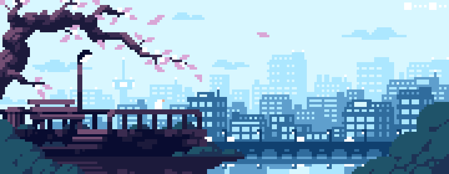
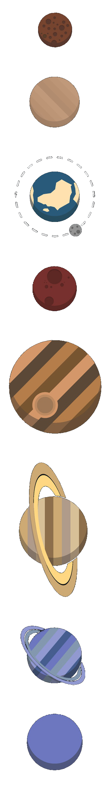

<!-- Sources:
https://github.com/alexandresanlim/Badges4-README.md-Profile
https://github.com/Ileriayo/markdown-badges
https://github.com/anuraghazra/github-readme-stats
 -->

<!-- https://www.pinterest.cl/pin/856035841641281772/ -->

# Hi! I'm Cristóbal :vulcan_salute:

<!-- https://hdqwalls.com/solar-system-minimalism-wallpaper -->
<!--  -->

### I'm an Electrical Engineering Master's student at Universidad de Chile, researcher at CASE, and doing my thesis at AC3E, with a passion for software and hardware

---
## :information_source: About me
- :dog: I love wiener dogs
- :hammer: I like to create things
- :drum: I play the drums on my spare time
- :video_game: I like to play video games (when I have the time)
- :computer: Low-level software enjoyer
- :wrench: I cosplay as a sysadmin

## :telescope: My areas of interest
- :abacus: Mathematics
- :star: Physics and astronomy
- :framed_picture: Signal and image processing
- :computer: Computer hardware and software
- :robot: Machine learning and robotics
- :zap: Electronics and control systems
- :video_game: Video game development
- :art: Graphics programming & Technical art

## :eyes: What I'm up to
- Working on my Master's thesis, around estimation of model drift in additive noise models
- Working at CASE, researching electrothermal modeling for lithium-ion batteries
- [**lion**](https://github.com/prognostics-lab/lion), a lithium-ion battery simulator in C
- [**otto**](https://github.com/No-tengo-nombre/otto), a GPGPU library for fast computing in C
- [**terra**](https://github.com/No-tengo-nombre/terra), a graphics engine made in C using the Vulkan API

## :wrench: Languages and tools

<!--  -->

<!-- ## :desktop_computer: My setup -->

<!--  -->
<!--  -->
<!--  -->

## :book: What I'm learning

---
